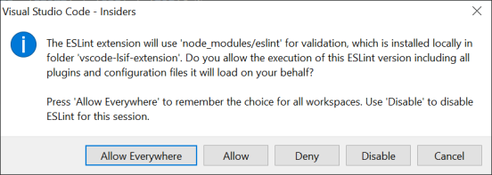

# VS Code ESLint extension

[](https://dev.azure.com/ms/vscode-eslint/_build/latest?definitionId=18)

Integrates [ESLint](http://eslint.org/) into VS Code. If you are new to ESLint check the [documentation](http://eslint.org/).

The extension uses the ESLint library installed in the opened workspace folder. If the folder doesn't provide one the extension looks for a global install version. If you haven't installed ESLint either locally or globally do so by running `npm install eslint` in the workspace folder for a local install or `npm install -g eslint` for a global install.

On new folders you might also need to create a `.eslintrc` configuration file. You can do this by either using the VS Code command `Create ESLint configuration` or by running the `eslint` command in a terminal. If you have installed ESLint globally (see above) then run [`eslint --init`](http://eslint.org/docs/user-guide/command-line-interface) in a terminal. If you have installed ESLint locally then run [`.\node_modules\.bin\eslint --init`](http://eslint.org/docs/user-guide/command-line-interface) under Windows and [`./node_modules/.bin/eslint --init`](http://eslint.org/docs/user-guide/command-line-interface) under Linux and Mac.

# Index
* [Release Notes](#release-notes)
* [Settings Options](#settings-options)
* [Settings Migration](#settings-migration)
* [Commands](#commands)
* [Using the extension with VS Code's task running](#using-the-extension-with-vs-codes-task-running)
* [Using ESLint to validate TypeScript files](#using-eslint-to-validate-typescript-files)
* [ESLint 6.x](#eslint-6x)

## Release Notes

This section describes major releases and their improvements. For a detailed list of changes please refer to the [change log](./CHANGELOG.md).

From version 2.2.3 on forward odd major, minor or patch version numbers indicate an insider or pre-release. So versions `2.2.3`, `2.2.5`, `2.3.1` and `3.0.0` will all be pre-release versions. `2.2.10`, `2.4.10` and `4.0.0` will all be regular release versions.

### Version 2.4.0 (same as 2.3.5 - Pre-release)

- added settings options to control the time budget for validation and fix on save before a
  warning or error is raised. The settings are `eslint.timeBudget.onValidation` and `eslint.timeBudget.onFixes`
- make server `untitled` agnostic
- the extension uses now VS Code's language status indicator
- the language status indicator now informs about long linting or fix on save times.
- the setting `eslint.alwaysShowStatus` got removed since the status is now shown as a language status indicator.
- support for flat config files
- support for single problem underline.
- various [bug fixes](https://github.com/microsoft/vscode-eslint/issues?q=is%3Aclosed+milestone%3A2.4.0)

### Version 2.3.5 - Pre-release

- added settings options to control the time budget for validation and fix on save before a
  warning or error is raised. The settings are `eslint.timeBudget.onValidation` and `eslint.timeBudget.onFixes`

### Version 2.3.3 - Pre-release

- make server `untitled` agnostic

### Version 2.3.1 - Pre-release (internal only)

- the extension uses now VS Code's language status indicator
- the language status indicator now informs about long linting or fix on save times.
- the setting `eslint.alwaysShowStatus` got removed since the status is now shown as a language status indicator.

### Version 2.3.0 - Pre-release

- support for flat config files
- support for single problem underline.
- various [bug fixes](https://github.com/microsoft/vscode-eslint/issues?q=is%3Aclosed+milestone%3A2.4.0)

### Version 2.2.6 (same as 2.2.5 Pre-release)

- added support for validating single notebook document cells if the language is supported by ESLint
- various [bug fixes](https://github.com/microsoft/vscode-eslint/milestone/47?closed=1)

### Version 2.2.5 - Pre-release

- added support for validating single notebook document cells if the language is supported by ESLint
- various [bug fixes](https://github.com/microsoft/vscode-eslint/milestone/47?closed=1)

### Version 2.2.0

Added support for ESLint V8.0 Beta. To stay backwards compatible with eslint settings the version still uses the CLIEngine if available. However users can force the use of the new ESLint API using the setting `eslint.useESLintClass`. Beware that the ESLint npm module changed how options are interpreted. It also changed the names of certain options. If you used `eslint.options` to pass special options to the ESLint npm module you might need to adapt the setting to the new [form](https://eslint.org/docs/developer-guide/nodejs-api#-new-eslintoptions).

### Version 2.1.22

Adapt VS Code's workspace trust model. As a consequence the custom dialog ESLint introduced in version `2.1.7` got removed. In addition the `off` value got added to the eslint rule customization support.

### Version 2.1.20

Added support to customize the severity of eslint rules. See the new setting `eslint.rules.customizations`.

### Version 2.1.18

Asking for confirmation of the `eslint.nodePath` value revealed a setup where that value is defined separately on a workspace folder level although a multi workspace folder setup is open (e.g. a code-workspace file). These setups need to define the `eslint.nodePath` value in the corresponding `code-workspace` file and the extension now warns the user about it. Below an example of such a `code-workspace` file

```json
{
        "folders": [
                {
                        "path": "project-a"
                },
                {
                        "path": "project-b"
                }
        ],
        "settings": {
                "eslint.nodePath": "myCustomNodePath"
        }
}
```

### Version 2.1.17

To follow VS Code's model to confirm workspace local settings that impact code execution the two settings `eslint.runtime` and `eslint.nodePath` now need user confirmation if defined locally in a workspace folder or a workspace file. Users using these settings in those local scopes will see a notification reminding them of the confirmation need.

The version also adds a command to restart the ESLint server.

### Version 2.1.10

The approval flow to allow the execution of a ESLint library got reworked. Its initial experience is now as follows:

- no modal dialog is shown when the ESLint extension tries to load an ESLint library for the first time and an approval is necessary. Instead the ESLint status bar item changes to  indicating that the execution is currently block.
- if the active text editor content would be validated using ESLint, a problem at the top of the file is shown in addition.

The execution of the ESLint library can be denied or approved using the following gestures:
- clicking on the status bar icon
- using the quick fix for the corresponding ESLint problem
- executing the command `ESLint: Manage Library Execution` from the command palette

All gestures will open the following dialog:



The chosen action is then reflected in the ESLint status bar item in the following way:

- `Allow` will prefix the status bar item with a check mark.
- `Allow Everywhere` will prefix the status bar item with a double check mark.
- `Deny` and `Disable` will prefix the status bar item with a blocked sign.

You can manage our decisions using the following commands:

- `ESLint: Manage Library Execution` will reopen above dialog
- `ESLint: Reset Library Decisions` lets you reset previous decisions who have made.

This release also addresses the vulnerability described in [CVE-2021-27081](https://msrc.microsoft.com/update-guide/vulnerability/CVE-2021-27081).

### Version 2.0.4

The 2.0.4 version of the extension contains the following major improvements:

* Improved TypeScript detection - As soon as TypeScript is correctly configured inside ESLint, you no longer need additional configuration through VS Code's `eslint.validate` setting. The same is true for HTML and Vue.js files.
* Glob working directory support - Projects that have a complex folder structure and need to customize the working directories via `eslint.workingDirectories` can now use glob patterns instead of listing every project folder. For example, `{ "pattern": "code-*" }` will match all project folders starting with `code-`. In addition, the extension now changes the working directory by default. You can disable this feature with the new `!cwd` property.
* Formatter support: ESLint can now be used as a formatter. To enable this feature use the `eslint.format.enable` setting.
* Improved Auto Fix on Save - Auto Fix on Save is now part of VS Code's Code Action on Save infrastructure and computes all possible fixes in one round. It is customized via the `editor.codeActionsOnSave` setting. The setting supports the ESLint specific property `source.fixAll.eslint`. The extension also respects the generic property `source.fixAll`.

The setting below turns on Auto Fix for all providers including ESLint:

```json
    "editor.codeActionsOnSave": {
        "source.fixAll": true
    }
```

In contrast, this configuration only turns it on for ESLint:

```json
    "editor.codeActionsOnSave": {
        "source.fixAll.eslint": true
    }
```

You can also selectively disable ESLint via:

```json
    "editor.codeActionsOnSave": {
        "source.fixAll": true,
        "source.fixAll.eslint": false
    }
```

Also note that there is a time budget of 750ms to run code actions on save which might not be enough for large JavaScript / TypeScript file. You can increase the time budget using the `editor.codeActionsOnSaveTimeout` setting.

The old `eslint.autoFixOnSave` setting is now deprecated and can safely be removed.

## Settings Options

If you are using an ESLint extension version < 2.x then please refer to the settings options [here](https://github.com/microsoft/vscode-eslint/blob/master/history/settings_1_9_x.md).

This extension contributes the following variables to the [settings](https://code.visualstudio.com/docs/customization/userandworkspace):

- `eslint.enable`: enable/disable ESLint for the workspace folder. Is enabled by default.
- `eslint.debug`: enables ESLint's debug mode (same as --debug  command line option). Please see the ESLint output channel for the debug output. This options is very helpful to track down configuration and installation problems with ESLint since it provides verbose information about how ESLint is validating a file.
- `eslint.lintTask.enable`: whether the extension contributes a lint task to lint a whole workspace folder.
- `eslint.lintTask.options`: Command line options applied when running the task for linting the whole workspace (https://eslint.org/docs/user-guide/command-line-interface).
  An example to point to a custom `.eslintrc.json` file and a custom `.eslintignore` is:
  ```json
  {
    "eslint.lintTask.options": "-c C:/mydirectory/.eslintrc.json --ignore-path C:/mydirectory/.eslintignore ."
  }
  ```
- `eslint.packageManager`: controls the package manager to be used to resolve the ESLint library. This has only an influence if the ESLint library is resolved globally. Valid values are `"npm"` or `"yarn"` or `"pnpm"`.
- `eslint.options`: options to configure how ESLint is started using either the [ESLint class API](http://eslint.org/docs/developer-guide/nodejs-api#eslint-class) or the [CLIEngine API](http://eslint.org/docs/developer-guide/nodejs-api#cliengine). The extension uses the ESLint class API if ESLint version 8 or higher is used or if ESLint version 7 is used and the setting `eslint.useESLintCLass` is set to true. In all other cases the CLIEngine API is used.
  An example to point to a custom `.eslintrc.json` file using the new ESLint API is:
  ```json
  {
    "eslint.options": { "overrideConfigFile": "C:/mydirectory/.eslintrc.json" }
  }
  ```
  An example to point to a custom `.eslintrc.json` file using the old CLIEngine API is:
  ```json
  {
    "eslint.options": { "configFile": "C:/mydirectory/.eslintrc.json" }
  }
  ```
- `eslint.useESLintClass` (@since 2.2.0) - whether to use the ESLint class API even if the CLIEngine API is present. The setting is only honor when using ESLint version 7.x.
- `eslint.run` - run the linter `onSave` or `onType`, default is `onType`.
- `eslint.quiet` - ignore warnings.
- `eslint.runtime` - use this setting to set the path of the node runtime to run ESLint under. [Use `"node"`](https://github.com/microsoft/vscode-eslint/issues/1233#issuecomment-815521280) if you want to use your default system version of node.
- `eslint.execArgv` - use this setting to pass additional arguments to the node runtime like `--max_old_space_size=4096`
- `eslint.nodeEnv` - use this setting if an ESLint plugin or configuration needs `process.env.NODE_ENV` to be defined.
- `eslint.nodePath` - use this setting if an installed ESLint package can't be detected, for example `/myGlobalNodePackages/node_modules`.
- `eslint.probe` - an array for language identifiers for which the ESLint extension should be activated and should try to validate the file. If validation fails for probed languages the extension says silent. Defaults to `["javascript", "javascriptreact", "typescript", "typescriptreact", "html", "vue", "markdown"]`.
- `eslint.validate` - an array of language identifiers specifying the files for which validation is to be enforced. This is an old legacy setting and should in normal cases not be necessary anymore. Defaults to `["javascript", "javascriptreact"]`.
- `eslint.format.enable`: enables ESLint as a formatter for validated files. Although you can also use the formatter on save using the setting `editor.formatOnSave` it is recommended to use the `editor.codeActionsOnSave` feature since it allows for better configurability.
- `eslint.workingDirectories` - specifies how the working directories ESLint is using are computed. ESLint resolves configuration files (e.g. `eslintrc`, `.eslintignore`) relative to a working directory so it is important to configure this correctly. If executing ESLint in the terminal requires you to change the working directory in the terminal into a sub folder then it is usually necessary to tweak this setting. (see also [ESLint class options#cwd](https://eslint.org/docs/developer-guide/nodejs-api#eslint-class)). Please also keep in mind that the `.eslintrc*` file is resolved considering the parent directories whereas the `.eslintignore` file is only honored in the current working directory. The following values can be used:
  - `[{ "mode": "location" }]` (@since 2.0.0): instructs ESLint to uses the workspace folder location or the file location (if no workspace folder is open) as the working directory. This is the default and is the same strategy as used in older versions of the ESLint extension (1.9.x versions).
  - `[{ "mode": "auto" }]` (@since 2.0.0): instructs ESLint to infer a working directory based on the location of `package.json`, `.eslintignore` and `.eslintrc*` files. This might work in many cases but can lead to unexpected results as well.
  - `string[]`: an array of working directories to use.
  Consider the following directory layout:
    ```
    root/
      client/
        .eslintrc.json
        client.js
      server/
        .eslintignore
        .eslintrc.json
        server.js
    ```
    Then using the setting:
    ```javascript
      "eslint.workingDirectories": [ "./client", "./server" ]
    ```
    will validate files inside the server directory with the server directory as the current eslint working directory. Same for files in the client directory. The ESLint extension will also change the process's working directory to the provided directories. If this is not wanted a literal with the `!cwd` property can be used (e.g. `{ "directory": "./client", "!cwd": true }`). This will use the client directory as the ESLint working directory but will not change the process`s working directory.
  - `[{ "pattern": glob pattern }]` (@since 2.0.0): Allows to specify a pattern to detect the working directory. This is basically a short cut for listing every directory. If you have a mono repository with all your projects being below a packages folder you can use `{ "pattern": "./packages/*/" }` to make all these folders working directories.
- `eslint.codeAction.disableRuleComment` - object with properties:
  - `enable` - show disable lint rule in the quick fix menu. `true` by default.
  - `location` - choose to either add the `eslint-disable` comment on the `separateLine` or `sameLine`. `separateLine` is the default.
  Example:
    ```json
    { "enable": true, "location": "sameLine" }
    ```
- `eslint.codeAction.showDocumentation` - object with properties:
  - `enable` - show open lint rule documentation web page in the quick fix menu. `true` by default.

- `eslint.codeActionsOnSave.mode` (@since 2.0.12) - controls which problems are fix when running code actions on save.
  - `all`: fixes all possible problems by revalidating the file's content. This executes the same code path as running eslint with the `--fix` option in the terminal and therefore can take some time. This is the default value.
  - `problems`: fixes only the currently known fixable problems as long as their textual edits are non-overlapping. This mode is a lot faster but very likely only fixes parts of the problems.

  Please note that if `eslint.codeActionsOnSave.mode` is set to `problems`, the `eslint.codeActionsOnSave.rules` is ignored.

- `eslint.codeActionsOnSave.rules` (@since 2.2.0) - controls the rules which are taken into consideration during code action on save execution. If not specified all rules specified via the normal ESLint configuration mechanism are consider. An empty array results in no rules being considered. If the array contains more than one entry the order matters and the first match determines the rule's on / off state. This setting is only honored under the following cases:

  - `eslint.codeActionsOnSave.mode` has a different value than `problems`
  -  the ESLint version used is either version 8 or higher or the version is 7.x and the setting `eslint.useESLintClass` is set to true (version >= 8 || (version == 7.x && eslint.useESLintClass)).

  In this example only semicolon related rules are considered:

  ```json
  "eslint.codeActionsOnSave.rules": [
    "*semi*"
  ]
  ```

  This example removes all TypeScript ESLint specific rules from the code action on save pass but keeps all other rules:

  ```json
  "eslint.codeActionsOnSave.rules": [
    "!@typescript-eslint/*",
    "*"
  ]
  ```

  This example keeps the indent and semi rule from TypeScript ESLint, disables all other TypeScript ESLint rules and keeps the rest:

  ```json
  "eslint.codeActionsOnSave.rules": [
	  "@typescript-eslint/semi",
	  "@typescript-eslint/indent",
	  "!@typescript-eslint/*",
	  "*"
  ]
  ```

- `eslint.rules.customizations` (@since 2.1.20) - force rules to report a different severity within VS Code compared to the project's true ESLint configuration. Contains two properties:
  - `"rule`": Select on rules with names that match, factoring in asterisks as wildcards: `{ "rule": "no-*", "severity": "warn" }`
    - Prefix the name with a `"!"` to target all rules that _don't_ match the name: `{ "rule": "!no-*", "severity": "info" }`
  - `"severity"`: Sets a new severity for matched rule(s), `"downgrade"`s them to a lower severity, `"upgrade"`s them to a higher severity, or `"default"`s them to their original severity

  In this example, all rules are overridden to warnings:

  ```json
  "eslint.rules.customizations": [
    { "rule": "*", "severity": "warn" }
  ]
  ```

  In this example, `no-` rules are informative, other rules are downgraded, and `"radix"` is reset to default:

  ```json
  "eslint.rules.customizations": [
    { "rule": "no-*", "severity": "info" },
    { "rule": "!no-*", "severity": "downgrade" },
    { "rule": "radix", "severity": "default" }
  ]
  ```

- `eslint.format.enable` (@since 2.0.0) - uses ESlint as a formatter for files that are validated by ESLint. If enabled please ensure to disable other formatters if you want to make this the default. A good way to do so is to add the following setting `"[javascript]": { "editor.defaultFormatter": "dbaeumer.vscode-eslint" }` for JavaScript. For TypeScript you need to add `"[typescript]": { "editor.defaultFormatter": "dbaeumer.vscode-eslint" }`.
- `eslint.onIgnoredFiles` (@since 2.0.10): used to control whether warnings should be generated when trying to lint ignored files. Default is `off`. Can be set to `warn`.
- `editor.codeActionsOnSave` (@since 2.0.0): this setting now supports an entry `source.fixAll.eslint`. If set to true all auto-fixable ESLint errors from all plugins will be fixed on save. You can also selectively enable and disabled specific languages using VS Code's language scoped settings. To disable `codeActionsOnSave` for HTML files use the following setting:
  ```json
  "[html]": {
    "editor.codeActionsOnSave": {
      "source.fixAll.eslint": false
    }
  }
  ```
  The old `eslint.autoFixOnSave` setting is now deprecated and can safely be removed. Please also note that if you use ESLint as your default formatter you should turn off `editor.formatOnSave` when you have turned on `editor.codeActionsOnSave`. Otherwise you file gets fixed twice which in unnecessary.
- `eslint.problems.shortenToSingleLine`: (@since 2.3.0) - Shortens the text spans of underlined problems to their first related line.
- `eslint.experimental.useFlatConfig`: (@since 2.3.0) - Enables support of experimental Flat Config (aka eslint.config.js, supported by ESLint version 8.21 or later)
- `eslint.timeBudget.onValidation` (@since 2.3.5) - controls the time budget that can be used for validation before a warning or an error is shown.
- `eslint.timeBudget.onFixes` (@since 2.3.5) - controls the time budget that can be used to compute fixes before a warning or an error is shown.

## Settings Migration

If the old `eslint.autoFixOnSave` option is set to true ESLint will prompt to convert it to the new `editor.codeActionsOnSave` format. If you want to avoid the migration you can respond in the dialog in the following ways:

- Not now: the setting will not be migrated by ESLint prompts again the next time you open the workspace
- Never migrate Settings: the settings migration will be disabled by changing the user setting `eslint.migration.2_x` to `off`

The migration can always be triggered manually using the command `ESLint: Migrate Settings`

## Commands:

This extension contributes the following commands to the Command palette.

- `Create '.eslintrc.json' file`: creates a new `.eslintrc.json` file.
- `Fix all auto-fixable problems`: applies ESLint auto-fix resolutions to all fixable problems.

## Using the extension with VS Code's task running

The extension is linting an individual file only on typing. If you want to lint the whole workspace set `eslint.lintTask.enable` to `true` and the extension will also contribute the `eslint: lint whole folder` task. There is no need any more to define a custom task in `tasks.json`.

## Using ESLint to validate TypeScript files

A great introduction on how to lint TypeScript using ESlint can be found in the [TypeScript - ESLint](https://github.com/typescript-eslint/typescript-eslint). Please make yourself familiar with the introduction before using the VS Code ESLint extension in a TypeScript setup. Especially make sure that you can validate TypeScript files successfully in a terminal using the `eslint` command.

This project itself uses ESLint to validate its TypeScript files. So it can be used as a blueprint to get started.

To avoid validation from any TSLint installation disable TSLint using `"tslint.enable": false`.

### Mono repository setup

As with JavaScript validating TypeScript in a mono repository requires that you tell the VS Code ESLint extension what the current working directories are. Use the `eslint.workingDirectories` setting to do so. For this repository the working directory setup looks as follows:

```json
	"eslint.workingDirectories": [ "./client", "./server" ]
```

## ESLint 6.x

Migrating from ESLint 5.x to ESLint 6.x might need some adaption (see the [ESLint Migration Guide](https://eslint.org/docs/user-guide/migrating-to-6.0.0) for details). Before filing an issue against the VS Code ESLint extension please ensure that you can successfully validate your files in a terminal using the eslint command.

